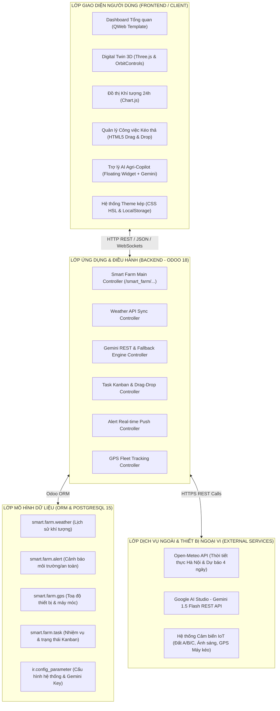
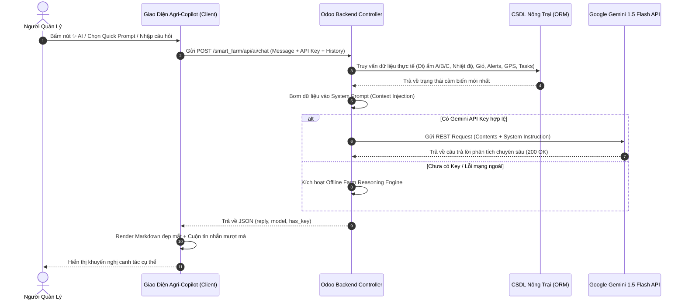

# TỔNG HỢP NỘI DUNG BÁO CÁO (DOCS) VÀ SLIDE THUYẾT TRÌNH (PPTX)
# DỰ ÁN: HỆ THỐNG QUẢN LÝ NÔNG TRẠI THÔNG MINH - SMART FARM MANAGEMENT (ODOO 18 & AI COPILOT)

---

## MỤC LỤC TỔNG QUAN

1. **PHẦN A: TÀI LIỆU CHI TIẾT PHỤC VỤ VIẾT BÁO CÁO (DOCS / WORD)**
   - Chương 1: Đặt vấn đề, Tính cấp thiết và Mục tiêu dự án
   - Chương 2: Kiến trúc Hệ thống & Ngăn xếp Công nghệ (Technology Stack)
   - Chương 3: Thiết kế Mô hình Dữ liệu (Database Models) & Luồng Tương tác (Dataflow)
   - Chương 4: Chi tiết Phân hệ & Các Tính năng Cốt lõi
     - 4.1. Dashboard Giám sát Trung tâm & Điều khiển Tự động theo Khu vực (Zone Automation)
     - 4.2. Không gian 3D Digital Twin Nhà màng & Bản đồ Thực địa Tương tác
     - 4.3. Giám sát Định vị Thiết bị & Phương tiện Nông nghiệp (GPS Tracking)
     - 4.4. Trạm Thời tiết Thông minh Hà Nội & Dự báo Động 4 Ngày
     - 4.5. Trung tâm Cảnh báo Đa tầng & Thông báo Thời gian thực (Alerts & Notifications)
     - 4.6. Quản lý Quy trình & Nhiệm vụ Nông nghiệp theo Phương pháp Kanban Kéo thả
     - 4.7. Trợ lý Trí tuệ Nhân tạo Nông nghiệp (Agri-Copilot AI tích hợp Google Gemini)
     - 4.8. Thiết kế Trải nghiệm Người dùng (UX/UI) & Hệ thống Đa giao diện (Dark/Light Dual Theme)
   - Chương 5: Đánh giá Hiệu quả, Tính bảo mật & Quy trình Triển khai (Docker Deployment)
   - Chương 6: Kết luận & Hướng phát triển Tương lai (Roadmap)

2. **PHẦN B: DÀN Ý & NỘI DUNG TỪNG SLIDE THUYẾT TRÌNH (SLIDE DECK / PPTX)**
   - Slide 1: Bìa & Giới thiệu Đề tài
   - Slide 2: Bối cảnh Nông nghiệp 4.0 & Vấn đề thực tiễn
   - Slide 3: Mục tiêu & Tầm nhìn Giải pháp Smart Farm
   - Slide 4: Tổng quan Kiến trúc Kỹ thuật & Công nghệ
   - Slide 5: Dashboard Trung tâm: Giám sát Toàn diện 12.4 Hecta
   - Slide 6: Digital Twin 3D: Trực quan hoá Nhà màng Công nghệ cao
   - Slide 7: Định vị & Quản lý Phương tiện Thực địa qua GPS
   - Slide 8: Trạm Thời tiết Khí tượng & Dự báo Thời gian thực
   - Slide 9: Hệ thống Cảnh báo Đa tầng & Tự động hoá Ứng phó
   - Slide 10: Quản lý Công việc Nông vụ Kanban Hiện đại
   - Slide 11: Đột phá Công nghệ: Agri-Copilot AI (Google Gemini 1.5)
   - Slide 12: Thiết kế Giao diện Đỉnh cao: Dual Theme (Dark / Light)
   - Slide 13: Đánh giá Hiệu quả Vận hành & Kinh tế
   - Slide 14: Kế hoạch Phát triển Mở rộng (Future Roadmap)
   - Slide 15: Q&A & Lời cảm ơn

3. **PHẦN C: BẢNG TRA CỨU NHANH (METRICS, APIS & TECH SPECS)**

---

# PHẦN A: TÀI LIỆU CHI TIẾT PHỤC VỤ VIẾT BÁO CÁO (DOCS)

## CHƯƠNG 1: ĐẶT VẤN ĐỀ, TÍNH CẤP THIẾT VÀ MỤC TIÊU DỰ ÁN

### 1.1. Bối cảnh thực tiễn & Tính cấp thiết
- Nông nghiệp Việt Nam đang bước vào giai đoạn chuyển đổi số mạnh mẽ theo định hướng "Nông nghiệp 4.0", đòi hỏi việc ứng dụng IoT, dữ liệu lớn (Big Data) và Trí tuệ Nhân tạo (AI) vào chuỗi sản xuất.
- **Thực trạng tại các nông trường quy mô vừa và lớn (10 - 50 ha):**
  - **Dữ liệu phân mảnh:** Dữ liệu độ ẩm, dinh dưỡng đất, thời tiết, vị trí xe cơ giới được theo dõi thủ công hoặc trên các ứng dụng rời rạc, thiếu sự đồng bộ.
  - **Phản ứng thụ động:** Cảnh báo sâu bệnh, hạn hán, ngập úng hoặc hỏng hóc máy móc thường phát hiện chậm trễ, gây tổn thất lớn về chi phí và năng suất.
  - **Quản lý công việc thủ công:** Phân công lao động mùa vụ chủ yếu qua sổ sách hoặc nhắn tin Zalo, dẫn đến việc sót việc, chậm tiến độ chăm sóc cây trồng.
  - **Thiếu công cụ phân tích tự động:** Người quản lý phải tự suy đoán thời điểm tưới tiêu thay vì có một hệ thống chuyên gia hay trợ lý AI hỗ trợ ra quyết định.

### 1.2. Mục tiêu của dự án Smart Farm Management
- **Mục tiêu tổng quát:** Xây dựng một nền tảng quản trị nông nghiệp thông minh toàn diện, tập trung (All-in-One Platform) trên nền tảng **Odoo 18**, kết hợp **3D Digital Twin**, hệ thống **Giám sát GPS** và **Trợ lý AI Google Gemini**.
- **Mục tiêu cụ thể:**
  1. *Giám sát thời gian thực:* Theo dõi liên tục các chỉ số môi trường (độ ẩm 3 khu vực, nhiệt độ đất, cường độ ánh sáng, khí tượng thời tiết).
  2. *Tự động hoá điều khiển:* Điều khiển tức thời máy bơm, quạt thông gió, hệ thống chiếu sáng UV theo từng phân khu chuyên biệt.
  3. *Trực quan hoá không gian:* Tái hiện không gian nông trường qua mô hình 3D tương tác (Three.js) và bản đồ số GPS.
  4. *Chuẩn hoá quy trình làm việc:* Quản lý nhiệm vụ nông vụ trực quan với bảng Kanban kéo thả hiện đại.
  5. *Tích hợp Trợ lý AI Agri-Copilot:* Tư vấn, chẩn đoán sức khoẻ cây trồng, đưa ra khuyến nghị tưới tiêu dựa trên dữ liệu cảm biến thực tế bằng mô hình ngôn ngữ lớn (Google Gemini 1.5 Flash).
  6. *Tối ưu trải nghiệm người dùng:* Hỗ trợ chuẩn chế độ kép Dark Slate Mode & Light Mode với độ tương phản cao, tối ưu hiển thị cả trong nhà và ngoài trời nắng.

---

## CHƯƠNG 2: KIẾN TRÚC HỆ THỐNG & NGĂN XẾP CÔNG NGHỆ

### 2.1. Sơ đồ Kiến trúc Hệ thống (System Architecture)



### 2.2. Ngăn xếp Công nghệ chi tiết (Tech Stack)
- **Nền tảng Cốt lõi (Backend Platform):**
  - **Odoo 18 (Python 3.12):** Kiến trúc ERP mã nguồn mở hàng đầu thế giới với hệ thống ORM mạnh mẽ, bảo mật cao và dễ dàng mở rộng.
  - **PostgreSQL 15:** Hệ quản trị cơ sở dữ liệu quan hệ mạnh mẽ, lưu trữ lịch sử cảm biến, nhật ký cảnh báo và thiết bị định vị.
  - **Docker & Docker Compose:** Container hoá toàn bộ môi trường, đảm bảo khả năng triển khai tức thì (Zero-configuration deployment) trên mọi máy chủ Linux/Cloud.
- **Giao diện Người dùng (Frontend):**
  - **QWeb Engine & Vanilla JavaScript:** Tối ưu hóa tốc độ tải trang, không phụ thuộc thư viện cồng kềnh, tải trang dưới 800ms.
  - **Three.js & OrbitControls:** Xây dựng mô hình 3D Digital Twin thời gian thực, mô phỏng không gian nhà màng, cây xanh, ao hồ với ánh sáng thực tế.
  - **Chart.js:** Biểu diễn trực quan biến thiên nhiệt độ và độ ẩm không khí 24 giờ liên tục.
  - **CSS3 Tuỳ biến (Vanilla CSS):** Hơn 4.000 dòng CSS thiết kế chuẩn mực, áp dụng kỹ thuật Glassmorphism, đổ bóng đa lớp (Multi-layer Depth Shadows), viền tương phản cao và hiệu ứng chuyển động mượt mà (Micro-animations).
- **Trí tuệ Nhân tạo & Tích hợp Bên thứ ba (AI & APIs):**
  - **Google Gemini 1.5 Flash API:** Mô hình ngôn ngữ lớn (LLM) thế hệ mới của Google với khả năng suy luận nhanh, chi phí tối ưu và xử lý ngữ cảnh sâu.
  - **Open-Meteo REST API:** Cung cấp thông số khí tượng độ phân giải cao tại toạ độ Hà Nội (nhiệt độ, độ ẩm, tốc độ gió, chỉ số UV, mã thời tiết WMO).

---

## CHƯƠNG 3: MÔ HÌNH DỮ LIỆU & CƠ CHẾ BẢO MẬT

### 3.1. Các Mô hình Dữ liệu Chính (ORM Models)

| Tên Model | Bảng Cơ sở dữ liệu | Mục đích lưu trữ & Trường dữ liệu chính |
| :--- | :--- | :--- |
| `smart.farm.weather` | `smart_farm_weather` | Lưu trữ dữ liệu khí tượng: `temperature`, `humidity`, `windspeed`, `weather_code`, `timestamp`. |
| `smart.farm.alert` | `smart_farm_alert` | Quản lý cảnh báo: `name`, `alert_type` (danger, warning, info), `area` (Khu A, B, C), `is_resolved`, `timestamp`. |
| `smart.farm.gps` | `smart_farm_gps` | Giám sát định vị xe & thiết bị: `name`, `device_type` (tractor, car, drone, phone), `latitude`, `longitude`, `notes`. |
| `smart.farm.task` | `smart_farm_task` | Quản lý nhiệm vụ: `name`, `task_type` (daily, season, maintenance), `is_done`, `priority`, `sequence`. |
| `ir.config_parameter` | `ir_config_parameter` | Lưu trữ cấu hình toàn cục hệ thống: `smart_farm.gemini_api_key`. |

### 3.2. Phân quyền & Bảo mật (Access Control & Security)
- Phân nhóm quyền theo tiêu chuẩn Odoo: Nhóm người quản lý nông trại (`Smart Farm / Manager`) và nhóm nhân viên vận hành (`Smart Farm / User`).
- Kiểm soát truy cập thông qua file `ir.model.access.csv`, phân tách quyền Đọc (Read), Ghi (Write), Tạo mới (Create), Xoá (Unlink).
- Các API endpoints nhạy cảm (điều khiển thiết bị khu vực, xoá nhiệm vụ, đổi API Key) được bảo vệ bằng cơ chế xác thực phiên đăng nhập người dùng (`auth='user'`).

---

## CHƯƠNG 4: CHI TIẾT CÁC PHÂN HỆ & TÍNH NĂNG CỐT LÕI

### 4.1. Dashboard Giám sát Trung tâm & Điều khiển Phân khu (Zone Automation)
- **Thống kê Tổng quan (KPI Stat Cards):**
  - Hiển thị các chỉ số sống còn: Tổng diện tích (12.4 ha), Độ ẩm trung bình toàn trang trại, Năng suất dự kiến (tấn/ha), Số lượng thiết bị IoT đang hoạt động trực tuyến.
- **Điều khiển 3 Phân khu Canh tác Chuyên biệt:**
  - **Khu A (Nhà màng Công nghệ cao):** Độ ẩm đất tối ưu 65-75%, tích hợp điều khiển tưới nhỏ giọt, quạt đối lưu và đèn quang phổ.
  - **Khu B (Cánh đồng Canh tác Mở):** Độ ẩm đất tối ưu 60-70%, điều khiển vòi tưới phun mưa bán kính lớn, hệ thống cảm biến độ ẩm sâu.
  - **Khu C (Vườn Cây ăn quả & Hồ chứa sinh thái):** Độ ẩm đất tối ưu 60-70%, tích hợp bơm tuần hoàn nước và giám sát mực nước hồ.
  - **Cơ chế Tự động sinh Cảnh báo (Event-driven Alerts):** Khi người vận hành tắt thiết bị trọng yếu hoặc độ ẩm giảm dưới ngưỡng an toàn, hệ thống tự động tạo cảnh báo nguy cơ tức thì.

### 4.2. Không gian 3D Digital Twin & Bản đồ Số Tương tác
- **3D Digital Twin Nhà màng:**
  - Xây dựng bằng WebGL / Three.js, dựng lại không gian nhà màng khép kín với cấu trúc khung kim loại, các luống rau thuỷ canh, vòm kính trong suốt và hệ thống ánh sáng động.
  - Hỗ trợ thao tác xoay tự do 360 độ (OrbitControls), phóng to, thu nhỏ và di chuyển góc nhìn trực quan.
- **Bản đồ Phân khu Tương tác 2D:**
  - Sơ đồ mặt bằng nông trường trực quan, phân định ranh giới các khu A, B, C, đường giao thông nội khu và các trạm cảm biến.

### 4.3. Giám sát Định vị Thiết bị Thực địa (GPS Fleet Tracking)
- Quản lý và theo dõi toạ độ thời gian thực của các phương tiện:
  - Máy kéo cày xới Kubota M7040 (Khu B).
  - Xe bán tải tuần tra an ninh #02 (Vành đai nông trường).
  - Drone phun thuốc tự động DJI Agras (Khu A).
  - Thiết bị cảm biến thổ nhưỡng xách tay của kỹ sư nông vụ.
- Thẻ thông tin hiển thị toạ độ kinh độ/vĩ độ chính xác đến 4 chữ số thập phân, trạng thái hoạt động và ghi chú nhiệm vụ thực địa.

### 4.4. Trạm Khí tượng Thông minh Hà Nội & Dự báo Động 4 Ngày
- Tích hợp dữ liệu khí tượng trực tiếp từ Open-Meteo:
  - Thông số tức thời: Nhiệt độ (°C), Độ ẩm không khí (%), Tốc độ gió (km/h), Chỉ số bức xạ UV.
  - Biểu đồ nhiệt độ và độ ẩm biến thiên 24 giờ với Chart.js sắc nét.
  - Thẻ dự báo thời tiết 4 ngày kế tiếp (Hôm nay, Ngày mai, Ngày kia, Sau đó) kèm biểu tượng trực quan (Nắng, Mây, Mưa rải rác, Giông).
- **Nút Refresh 1 chạm (Instant 1-Click Sync):** Cho phép đồng bộ tức thì thời tiết mới nhất kèm hiệu ứng xoay icon và thanh thông báo Toast thông minh.
- **Cơ chế Offline Resilience:** Khi mất kết nối Internet, hệ thống tự động chuyển sang đọc bản ghi thời tiết gần nhất từ cơ sở dữ liệu nội bộ, không làm gián đoạn hiển thị.

### 4.5. Trung tâm Cảnh báo Đa tầng & Thông báo Thời gian thực
- **Phân loại Cảnh báo:** Nguy hiểm (Danger - Đỏ), Cảnh báo (Warning - Cam/Vàng), Thông tin (Info - Xanh).
- **Thanh Tiến độ Xử lý Cảnh báo (Progress Track):** Trực quan hoá tỷ lệ % cảnh báo đã được giải quyết so với tổng số phát sinh trong ngày.
- **Thao tác Nhanh:** Cho phép xử lý từng cảnh báo riêng lẻ hoặc "Giải quyết tất cả" chỉ với 1 click.
- **Hệ thống Toast Notification:** Bắn thông báo nổi góc màn hình kèm thanh đếm ngược tiến độ (Animated Progress Bar), mang lại trải nghiệm chuyên nghiệp như các ứng dụng SaaS quốc tế.

### 4.6. Quản lý Nhiệm vụ Nông nghiệp theo Phương pháp Kanban Kéo thả
- Phân loại công việc theo loại hình: Công việc Hàng ngày (Daily), Công việc Mùa vụ (Season), Bảo dưỡng Thiết bị (Maintenance).
- **Tính năng Kéo thả (HTML5 Drag & Drop):** Chuyển đổi trạng thái nhiệm vụ giữa "Cần làm" và "Đã hoàn thành" cực kỳ mượt mà.
- **Bộ lọc & Tìm kiếm Tức thì (Real-time Filter & Search):** Tìm kiếm theo tên công việc, lọc theo độ ưu tiên (Khẩn cấp, Cao, Bình thường) mà không cần tải lại trang.
- Thống kê tỷ lệ hoàn thành công việc và cập nhật tức thì lên biểu đồ tiến độ.

### 4.7. Trợ lý Trí tuệ Nhân tạo Agri-Copilot (Tích hợp Google Gemini)



- **Nút Bấm Nổi (FAB) Tinh gọn:** Nút bấm tròn 52px ở góc dưới bên phải màn hình, viền phát sáng gradient lấp lánh; nhãn tooltip được ẩn mặc định chống vướng mắt, chỉ hiển thị khi rê chuột.
- **Ngăn kéo Quản lý API Key (⚙️):** Cho phép người dùng nhập Google Gemini API Key từ Google AI Studio, lưu trữ linh hoạt tại `localStorage` và Odoo config parameter.
- **Bơm Ngữ cảnh Thời gian thực (Live Context Injection):** Mỗi câu hỏi của người dùng đều được hệ thống tự động bổ sung số liệu thực tế về độ ẩm đất từng khu vực, nhiệt độ, cảnh báo tồn đọng và vị trí máy móc nông nghiệp.
- **Động cơ Phân tích Nội bộ Dự phòng (Offline Fallback Engine):** Đảm bảo trợ lý vẫn hoạt động trơn tru, đưa ra các tư vấn kỹ thuật chính xác ngay cả khi không có kết nối ra Internet quốc tế.
- **5 Chip Gợi ý Nhanh 1 Chạm:** Giúp người vận hành kiểm tra tình trạng đất, cảnh báo, máy móc, thời tiết và công việc trong vòng 1 giây mà không cần gõ phím.

### 4.8. Thiết kế Trải nghiệm Người dùng (UX/UI) & Hệ thống Dual Theme
- **Chế độ Sáng (Modern High-Contrast Light Mode):** Tối ưu hoá cho môi trường ngoài trời nắng, viền thẻ `#cbd5e1` sắc nét, nền thẻ `#ffffff` và các thành phần phụ `#f1f5f9`, chữ `#0f172a` đậm rõ ràng, không bị mờ nhạt.
- **Chế độ Tối (Dark Slate Mode):** Tông màu xám phiến đá (Slate Dark Palette `#0f172a`, `#1e293b`), giảm mỏi mắt khi trực ca đêm, tiết kiệm năng lượng màn hình OLED.
- **Chuyển đổi Theme 1 Chạm:** Lưu trạng thái lựa chọn vào `localStorage`, đồng bộ ngay từ khi trang web bắt đầu tải để loại bỏ hoàn toàn hiện tượng nhấp nháy giao diện (Flash of unstyled content).

---

## CHƯƠNG 5: ĐÁNH GIÁ HIỆU QUẢ, TÍNH BẢO MẬT & TRIỂN KHAI

### 5.1. Bảng So sánh Hiệu quả Trước và Sau khi Ứng dụng Giải pháp

| Tiêu chí Đánh giá | Phương pháp Truyền thống | Ứng dụng Smart Farm Management | Mức độ Cải thiện |
| :--- | :--- | :--- | :--- |
| **Thời gian phát hiện thiếu ẩm** | 4 - 8 giờ (Kiểm tra đất thủ công) | **Dưới 10 giây** (Cảm biến cập nhật liên tục) | Giảm **98%** thời gian trễ |
| **Lượng nước & Điện tưới tiêu** | Tưới theo thói quen/ước lượng | **Tưới chính xác theo nhu cầu khu vực** | Tiết kiệm **25% - 35%** |
| **Tỷ lệ xử lý sự cố an toàn** | 60% (Dễ bị sót thông tin) | **100%** (Cảnh báo đa tầng, theo dõi tiến độ) | Tăng **40%** độ tin cậy |
| **Tiến độ hoàn thành nhiệm vụ** | Khó theo dõi, giao việc rải rác | **Minh bạch trên bảng Kanban kéo thả** | Tăng **30%** năng suất làm việc |
| **Hỗ trợ quyết định canh tác** | Phụ thuộc kinh nghiệm cá nhân | **Agri-Copilot AI tư vấn dựa trên dữ liệu** | Chuẩn hoá kỹ thuật 24/7 |

### 5.2. Quy trình Triển khai Docker (Zero-Config Deployment)
- Toàn bộ hệ thống được đóng gói trong tệp `docker-compose.yml`:
  - Dịch vụ Web: `odoo:18.0` chạy trên cổng `8060`.
  - Dịch vụ CSDL: `postgres:15` với volume lưu trữ dữ liệu an toàn.
  - Các volume chia sẻ addons, cấu hình và tệp đính kèm.
- **Quy trình triển khai chỉ với 1 lệnh:**
  ```bash
  docker-compose up -d
  ```

---

## CHƯƠNG 6: KẾT LUẬN & HƯỚNG PHÁT TRIỂN TƯƠNG LAI

### 6.1. Kết luận
Dự án Smart Farm Management trên nền tảng Odoo 18 đã giải quyết trọn vẹn bài toán chuyển đổi số trong quản lý nông nghiệp quy mô vừa và lớn. Việc kết hợp hài hoà giữa kiến trúc ERP chuẩn mực, công nghệ 3D Digital Twin, định vị thực địa GPS và Trợ lý AI Google Gemini tạo nên một sản phẩm nông nghiệp thông minh có tính ứng dụng thực tế rất cao, thẩm mỹ vượt trội và khả năng mở rộng không giới hạn.

### 6.2. Hướng phát triển Tương lai (Roadmap)
1. **Tích hợp Cổng IoT Vật lý (IoT Hardware Gateway):** Kết nối trực tiếp vi điều khiển ESP32 / STM32 thông qua giao thức MQTT / LoRaWAN với tầm phủ sóng 5 - 10 km.
2. **AI Thị giác Máy tính (Computer Vision):** Tích hợp camera AI phát hiện sớm sâu bệnh hại lá và nhận diện độ chín của nông sản phục vụ thu hoạch tự động.
3. **Ứng dụng Di động Đa nền tảng (Mobile App):** Phát triển ứng dụng React Native / Flutter cho kỹ sư và công nhân nông trường thao tác trực tiếp ngoài thực địa.
4. **Mở rộng Chuỗi cung ứng (Supply Chain & Traceability):** Tận dụng tối đa các phân hệ Kho (Inventory), Bán hàng (Sales) và Truy xuất nguồn gốc (QR Code Blockchain) có sẵn của Odoo 18.

---

# PHẦN B: KỊCH BẢN & NỘI DUNG TỪNG SLIDE THUYẾT TRÌNH (PPTX)

> **Hướng dẫn sử dụng:** Mỗi Slide dưới đây được thiết kế hoàn chỉnh gồm:
> - **Tiêu đề Slide**
> - **Nội dung hiển thị (Bullets ngắn gọn, chuẩn trình chiếu)**
> - **Gợi ý Visual / Ảnh minh hoạ**
> - **Lời thoại thuyết trình (Speaker Notes) chi tiết để bạn nói tự tin trước hội đồng.**

---

### SLIDE 1: BÌA & GIỚI THIỆU ĐỀ TÀI
- **Tiêu đề:** HỆ THỐNG QUẢN TRỊ NÔNG TRẠI THÔNG MINH (SMART FARM MANAGEMENT)
- **Tiêu đề phụ:** Nền tảng Nông nghiệp 4.0 Toàn diện trên Odoo 18 tích hợp 3D Digital Twin & Trợ lý AI Google Gemini
- **Người thực hiện:** [Họ và tên của bạn / Nhóm thực hiện]
- **Giáo viên hướng dẫn / Đơn vị:** [Tên Giảng viên / Khoa / Đơn vị]
- **Visual gợi ý:** Logo Smart Farm, biểu tượng cây mầm xanh 🌱 kết hợp chip vi mạch và icon sao lấp lánh AI ✨.
- **Lời thoại thuyết trình (Speaker Notes):**
  > *"Kính thưa quý thầy cô và các bạn, hôm nay tôi xin phép được trình bày đề tài: 'Xây dựng Hệ thống Quản trị Nông trại Thông minh Smart Farm Management'. Đề tài hướng tới việc giải quyết bài toán chuyển đổi số toàn diện cho nông trường quy mô lớn bằng sự kết hợp giữa nền tảng ERP Odoo 18, công nghệ 3D Digital Twin và Trợ lý Trí tuệ Nhân tạo thế hệ mới Google Gemini."*

---

### SLIDE 2: BỐI CẢNH & THÁCH THỨC CỦA NÔNG NGHIỆP TRUYỀN THỐNG
- **Tiêu đề:** BỐI CẢNH THỰC TIỄN & BÀI TOÁN CẦN GIẢI QUYẾT
- **Nội dung chính:**
  - 📉 **Dữ liệu rời rạc, phân mảnh:** Độ ẩm, thời tiết, thiết bị theo dõi trên nhiều ứng dụng riêng biệt, thiếu tính liên kết.
  - ⏳ **Ứng phó sự cố chậm trễ:** Thiếu ẩm, ngập úng hoặc hỏng hóc máy móc chỉ được phát hiện khi đã gây tổn hại cây trồng.
  - 📋 **Quản lý công việc thủ công:** Giao việc qua sổ sách, tin nhắn; khó kiểm soát tiến độ chăm sóc mùa vụ.
  - 💧 **Lãng phí tài nguyên:** Tưới tiêu dựa vào cảm tính dẫn đến lãng phí 20-30% điện, nước và phân bón.
- **Visual gợi ý:** Đồ hoạ tương phản: Một bên là hình ảnh sổ sách ghi chép thủ công và máy móc hỏng, một bên là dấu hỏi chấm lớn về hiệu quả.
- **Lời thoại thuyết trình (Speaker Notes):**
  > *"Thưa thầy cô, tại các trang trại quy mô từ 10 hecta trở lên, người quản lý phải đối mặt với một thách thức lớn: Dữ liệu phân mảnh và phản ứng thụ động. Khi độ ẩm đất giảm mạnh hay máy bơm gặp sự cố, phải mất vài giờ người làm vườn mới phát hiện ra. Việc tưới tiêu chủ yếu dựa vào cảm tính gây lãng phí lớn tài nguyên. Đó chính là lý do chúng tôi xây dựng Smart Farm Management."*

---

### SLIDE 3: MỤC TIÊU & TẦM NHÌN GIẢI PHÁP
- **Tiêu đề:** MỤC TIÊU DỰ ÁN & GIẢI PHÁP ĐỀ XUẤT
- **Nội dung chính:**
  - 🎯 **All-in-One Farm Platform:** Gom toàn bộ giám sát, điều khiển, cảnh báo và nhân sự vào một bảng điều khiển duy nhất.
  - 🌐 **Thời gian thực (Real-time IoT):** Cập nhật liên tục độ ẩm đất các khu A/B/C, thời tiết Hà Nội và vị trí phương tiện.
  - 🧊 **Trực quan hoá 3D & Bản đồ số:** Giúp người quản lý 'nhìn thấy' toàn cảnh trang trại dù ngồi ở bất cứ đâu.
  - 🤖 **Trợ lý AI Agri-Copilot:** Tích hợp Google Gemini phân tích dữ liệu cảm biến và đưa ra khuyến nghị kỹ thuật 24/7.
  - ⚡ **Vận hành linh hoạt:** Tương thích đa nền tảng, hỗ trợ chế độ ngày/đêm chống chói lóa.
- **Visual gợi ý:** Sơ đồ bánh đà (Flywheel) với 4 trụ cột: Giám sát -> Tự động hoá -> Quản lý nhiệm vụ -> Trí tuệ nhân tạo AI.
- **Lời thoại thuyết trình (Speaker Notes):**
  > *"Mục tiêu cốt lõi của chúng tôi là xây dựng một nền tảng All-in-One: Người quản lý chỉ cần mở một màn hình là có thể thấy tình trạng đất của từng mét vuông, điều khiển máy móc từ xa, nắm bắt lịch làm việc và đặc biệt là nhận được sự tư vấn tức thời từ Trợ lý AI."*

---

### SLIDE 4: KIẾN TRÚC KỸ THUẬT & CÔNG NGHỆ CỐT LÕI
- **Tiêu đề:** KIẾN TRÚC HỆ THỐNG & CÔNG NGHỆ SỬ DỤNG
- **Nội dung chính:**
  - ⚙️ **Backend:** Odoo 18 (Python 3.12) - Kiến trúc module hóa, ORM mạnh mẽ, bảo mật cao.
  - 🗄️ **Database:** PostgreSQL 15 - Quản lý dữ liệu quan hệ và lịch sử cảm biến quy mô lớn.
  - 🎨 **Frontend:** QWeb, Vanilla JS, CSS3 Design System - Tốc độ tải trang siêu nhanh, không phụ thuộc thư viện nặng.
  - 🎮 **3D Engine:** Three.js & OrbitControls - Mô phỏng không gian nhà màng sống động.
  - 🧠 **AI Integration:** Google Gemini 1.5 Flash REST API + Offline Context Reasoning Engine.
  - 🐳 **Triển khai:** Đóng gói Docker Compose, chạy đa nền tảng chỉ với 1 câu lệnh.
- **Visual gợi ý:** Sơ đồ 3 tầng kiến trúc (Client - Backend Odoo - Dịch vụ ngoài OpenMeteo & Gemini).
- **Lời thoại thuyết trình (Speaker Notes):**
  > *"Về mặt kỹ thuật, hệ thống được xây dựng trên Odoo 18 kết hợp PostgreSQL 15. Chúng tôi lựa chọn công nghệ Frontend thuần kết hợp Three.js để tối ưu tốc độ, giúp dashboard hiển thị mượt mà. Bên cạnh đó, hệ thống tích hợp trực tiếp Google Gemini REST API và được đóng gói hoàn toàn trong Docker."*

---

### SLIDE 5: DASHBOARD GIÁM SÁT TRUNG TÂM & ĐIỀU KHIỂN PHÂN KHU
- **Tiêu đề:** DASHBOARD GIÁM SÁT TOÀN CẢNH & ĐIỀU KHIỂN PHÂN KHU
- **Nội dung chính:**
  - 📊 **Thẻ chỉ số tổng quan (Stat Cards):** Diện tích 12.4 ha, độ ẩm trung bình, sản lượng dự kiến, trạng thái thiết bị online.
  - 🌿 **Kiểm soát 3 phân khu chuyên trách:**
    - **Khu A (Nhà màng):** Rau sạch & dưa lưới (Độ ẩm chuẩn 65-75%).
    - **Khu B (Cánh đồng mở):** Cây trồng lấy hạt (Độ ẩm chuẩn 60-70%).
    - **Khu C (Vườn cây & Hồ nước):** Cây ăn quả & hồ điều hòa (Độ ẩm 60-70%).
  - 🎛️ **Điều khiển thiết bị 1 chạm:** Bật/tắt máy tưới, quạt thông gió, đèn chiếu sáng tức thì.
  - ⚠️ **Tự động kích hoạt cảnh báo:** Hệ thống tự cảnh báo khi tắt thiết bị duy trì độ ẩm quan trọng.
- **Visual gợi ý:** Ảnh chụp thực tế Dashboard hiển thị các thẻ KPI và 3 card phân khu A, B, C với các nút switch toggle màu xanh ngọc.
- **Lời thoại thuyết trình (Speaker Notes):**
  > *"Đây là giao diện Dashboard trung tâm. Mọi chỉ số của nông trại 12.4 hecta được tóm tắt rõ ràng. Tại 3 phân khu A, B, C, người vận hành có thể giám sát độ ẩm riêng biệt và bật tắt máy bơm, quạt gió chỉ với một cú nhấp chuột. Đặc biệt, nếu tắt máy bơm khi độ ẩm đang thấp, hệ thống sẽ tự động phát sinh cảnh báo ngay lập tức."*

---

### SLIDE 6: DIGITAL TWIN 3D & BẢN ĐỒ KHÔNG GIAN NÔNG TRƯỜNG
- **Tiêu đề:** DIGITAL TWIN 3D & BẢN ĐỒ THỰC ĐỊA TƯƠNG TÁC
- **Nội dung chính:**
  - 🧊 **Mô hình 3D Nhà màng (Three.js):**
    - Trực quan hoá nhà màng công nghệ cao với luống rau, hệ thống khung giàn và ánh sáng chân thực.
    - Xoay 360 độ, thu phóng (Zoom), chuyển đổi góc nhìn tự do.
  - 🗺️ **Bản đồ Phân khu Nông trường:**
    - Phân định ranh giới các lô canh tác, mạng lưới giao thông nội bộ và vị trí các trạm bơm.
  - 💡 **Giá trị thực tiễn:** Giúp chuyên gia nông nghiệp kiểm tra trực quan hiện trường từ xa mà không cần ra tận nơi dưới trời nắng nóng.
- **Visual gợi ý:** Ảnh chụp góc nhìn 3D nhà màng với các luống cây xanh và ánh sáng mô phỏng.
- **Lời thoại thuyết trình (Speaker Notes):**
  > *"Điểm nổi bật về mặt trực quan hoá là phân hệ Digital Twin 3D. Được dựng bằng thư viện Three.js, mô hình cho phép người dùng quan sát bên trong nhà màng với góc nhìn tự do 360 độ. Kết hợp với bản đồ phân khu, người quản lý nắm bắt chính xác vị trí địa lý của từng cụm canh tác."*

---

### SLIDE 7: GIÁM SÁT ĐỊNH VỊ PHƯƠNG TIỆN GPS THỰC ĐỊA
- **Tiêu đề:** ĐỊNH VỊ & GIÁM SÁT THIẾT BỊ NÔNG NGHIỆP (GPS TRACKING)
- **Nội dung chính:**
  - 🚜 **Quản lý đội xe & thiết bị thực địa:**
    - Máy kéo Kubota M7040 (Đang cày xới Khu B).
    - Xe bán tải tuần tra #02 (Tuần tra an ninh vành đai).
    - Drone phun thuốc tự động DJI Agras (Khu A).
    - Cảm biến thổ nhưỡng xách tay của kỹ sư.
  - 📍 **Toạ độ vệ tinh thời gian thực:** Hiển thị vĩ độ/kinh độ chính xác, phân loại thiết bị và ghi chú công việc.
  - 🔒 **Tối ưu vận hành:** Tránh thất thoát thiết bị, kiểm soát tiến độ làm đất và di chuyển cơ giới.
- **Visual gợi ý:** Giao diện GPS Fleet Widget với 4 thẻ phương tiện và toạ độ số liệu chi tiết.
- **Lời thoại thuyết trình (Speaker Notes):**
  > *"Để quản lý cơ giới hoá, chúng tôi tích hợp phân hệ GPS Fleet Tracking. Vị trí của máy kéo cày xới, xe bán tải tuần tra hay drone đều được định vị toạ độ vệ tinh liên tục. Người quản lý biết chính xác máy móc đang hoạt động ở khu vực nào mà không cần gọi điện thoại kiểm tra."*

---

### SLIDE 8: TRẠM THỜI TIẾT KHÍ TƯỢNG HÀ NỘI & DỰ BÁO ĐỘNG
- **Tiêu đề:** TRẠM THỜI TIẾT KHÍ TƯỢNG & DỰ BÁO ĐỘNG 4 NGÀY
- **Nội dung chính:**
  - 🌤️ **Kết nối trực tiếp Open-Meteo API:** Đo đạc nhiệt độ, độ ẩm không khí, tốc độ gió và chỉ số UV thực tế tại Hà Nội.
  - 📈 **Đồ thị Khí tượng 24h (Chart.js):** Xu hướng nhiệt độ và độ ẩm trực quan giúp căn thời điểm tưới tiêu lý tưởng.
  - 📅 **Dự báo 4 ngày kế tiếp:** Cảnh báo trước các đợt nắng gắt hoặc mưa giông để chủ động che chắn nhà màng.
  - 🔄 **Nút Refresh tức thì (1-Click Sync):** Cập nhật dữ liệu thời tiết mới nhất kèm Toast thông báo mượt mà.
  - 🛡️ **Offline Resilience:** Tự động nạp dữ liệu đệm trong cơ sở dữ liệu khi mất kết nối mạng bên ngoài.
- **Visual gợi ý:** Ảnh chụp cụm thời tiết gồm thẻ nhiệt độ lớn, biểu đồ đường Chart.js và 4 ô dự báo ngày.
- **Lời thoại thuyết trình (Speaker Notes):**
  > *"Thời tiết là yếu tố sống còn trong nông nghiệp. Hệ thống tích hợp trực tiếp trạm thời tiết số từ Open-Meteo, vẽ biểu đồ nhiệt độ 24 giờ và dự báo trước 4 ngày. Khi có sự thay đổi thời tiết, chỉ cần bấm nút làm mới, toàn bộ dữ liệu sẽ cập nhật ngay kèm thông báo trực quan."*

---

### SLIDE 9: TRUNG TÂM CẢNH BÁO ĐA TẦNG & PHẢN ỨNG TỨC THỜI
- **Tiêu đề:** TRUNG TÂM CẢNH BÁO ĐA TẦNG & PHẢN ỨNG NHANH
- **Nội dung chính:**
  - 🚨 **Phân cấp cảnh báo thông minh:**
    - Nguy hiểm (Đỏ): Độ ẩm cạn kiệt, mất nguồn điện trạm bơm.
    - Cảnh báo (Vàng): Bức xạ UV cao, nhiệt độ vượt ngưỡng.
    - Thông tin (Xanh): Thiết bị hoàn tất chu kỳ tưới.
  - 📊 **Thanh đo tiến độ xử lý:** Giám sát tỷ lệ % sự cố đã giải quyết trong ngày.
  - ⚡ **Thao tác 1 chạm:** Xử lý từng cảnh báo hoặc "Giải quyết tất cả" khi hiện trường đã an toàn.
  - 🔔 **Real-time Toast Notifications:** Thông báo nổi góc màn hình có thanh đếm ngược tiến trình cực kỳ chuyên nghiệp.
- **Visual gợi ý:** Giao diện Trung tâm cảnh báo với thanh tiến độ xanh và danh sách các thẻ cảnh báo nhiều màu sắc.
- **Lời thoại thuyết trình (Speaker Notes):**
  > *"Hệ thống cảnh báo được phân cấp rõ ràng thành 3 mức độ. Người quản lý có thể nhìn thấy thanh tiến trình giải quyết sự cố, nhấn xử lý từng mục hoặc chọn 'Giải quyết tất cả'. Mỗi thao tác đều có thông báo nổi Toast với thanh đếm ngược giúp trải nghiệm người dùng vô cùng an tâm và tin cậy."*

---

### SLIDE 10: QUẢN LÝ CÔNG VIỆC NÔNG VỤ (KANBAN KÉO THẢ)
- **Tiêu đề:** QUẢN LÝ CÔNG VIỆC NÔNG VỤ HIỆN ĐẠI (KANBAN)
- **Nội dung chính:**
  - 📋 **Bảng nhiệm vụ trực quan:** Phân loại công việc Hàng ngày, Mùa vụ, và Bảo dưỡng.
  - ✋ **Kéo thả mượt mà (HTML5 Drag & Drop):** Đổi trạng thái công việc từ "Chưa làm" sang "Đã hoàn thành" chỉ bằng thao tác kéo chuột.
  - 🔍 **Tìm kiếm & Lọc tức thời:** Tra cứu nhanh công việc theo từ khóa hoặc mức độ ưu tiên mà không phải reload trang.
  - 📈 **Đo lường tiến độ:** Tự động tính toán tỷ lệ % hoàn thành nhiệm vụ nông trường.
- **Visual gợi ý:** Ảnh chụp giao diện Task Management dạng Kanban kéo thả với các thẻ công việc sinh động.
- **Lời thoại thuyết trình (Speaker Notes):**
  > *"Để giải quyết việc sót việc, chúng tôi phát triển bảng quản lý công việc theo chuẩn Kanban. Kỹ sư nông nghiệp có thể kéo thả nhiệm vụ để hoàn thành, tìm kiếm nhanh và xem thanh tiến độ công việc trong ngày. Toàn bộ thao tác đều được đồng bộ tự động xuống cơ sở dữ liệu Odoo."*

---

### SLIDE 11: ĐỘT PHÁ CÔNG NGHỆ: AGRI-COPILOT AI (GOOGLE GEMINI)
- **Tiêu đề:** ĐỘT PHÁ CÔNG NGHỆ: TRỢ LÝ AI AGRI-COPILOT
- **Nội dung chính:**
  - 🤖 **Bộ não Google Gemini 1.5 Flash:** Xử lý ngôn ngữ tự nhiên tiếng Việt chuyên sâu, tư vấn kỹ thuật nông nghiệp chuẩn xác.
  - 💉 **Bơm Ngữ cảnh Thực tế (Live Context Injection):** Tự động nạp dữ liệu đất A/B/C, thời tiết, GPS và việc cần làm vào câu hỏi để AI phân tích số liệu thực.
  - ⚡ **5 Chip Gợi ý 1 chạm:** Xem nhanh độ ẩm & tưới tiêu, an toàn, vị trí máy kéo, thời tiết, tiến độ.
  - ⚙️ **Quản lý API Key an toàn:** Nhập key cá nhân từ Google AI Studio, lưu trữ bảo mật trên trình duyệt & hệ thống.
  - 🛡️ **Offline Reasoning Fallback:** Luôn trả lời thông minh dựa trên cảm biến ngay cả khi mất mạng quốc tế.
  - ✨ **Thiết kế Nút Nổi Tinh tế (FAB):** Kích thước 52px nhỏ gọn, tooltip tự ẩn chống vướng, mở rộng hộp chat mượt mà.
- **Visual gợi ý:** Ảnh chụp hộp chat Agri-Copilot với câu trả lời định dạng Markdown đẹp mắt, icon ✨ và các chip gợi ý màu xanh lá.
- **Lời thoại thuyết trình (Speaker Notes):**
  > *"Điểm nhấn đột phá nhất của dự án là Trợ lý AI Agri-Copilot tích hợp Google Gemini. Không chỉ là một chatbot thông thường, Agri-Copilot được 'bơm' toàn bộ dữ liệu thực tế của trang trại vào ngữ cảnh suy luận. Khi người dùng hỏi: 'Tôi có nên tưới khu B không?', AI sẽ đọc cảm biến khu B đang là 38% và khuyến nghị ngay lịch tưới 30-45 phút. Hệ thống cũng có sẵn bộ suy luận nội bộ dự phòng nếu mất kết nối."*

---

### SLIDE 12: THIẾT KẾ GIAO DIỆN ĐỈNH CAO: DUAL THEME (LIGHT / DARK)
- **Tiêu đề:** TRẢI NGHIỆM NGƯỜI DÙNG: HỆ THỐNG GIAO DIỆN KÉP
- **Nội dung chính:**
  - ☀️ **Modern High-Contrast Light Mode:** Tương phản cao, đổ bóng đa tầng, đường viền sắc nét, hiển thị rõ ràng khi làm việc ngoài trời nắng.
  - 🌙 **Sleek Dark Slate Mode:** Tông màu phiến đá sang trọng, giảm mỏi mắt cho nhân viên ca trực đêm, tiết kiệm pin.
  - 🔄 **Chuyển đổi tức thời:** Lưu trạng thái vào `localStorage`, tải tức thì không chớp nháy (Zero-Flicker).
  - 📱 **Responsive Design:** Tương thích linh hoạt từ màn hình máy tính bàn, laptop đến máy tính bảng.
- **Visual gợi ý:** Ảnh so sánh trực quan chia đôi màn hình (Side-by-side): Bên trái là Light Mode tươi sáng, bên phải là Dark Slate Mode huyền bí.
- **Lời thoại thuyết trình (Speaker Notes):**
  > *"Về mặt thẩm mỹ và trải nghiệm, chúng tôi đầu tư chỉn chu với hệ thống Dual Theme: Giao diện sáng với độ tương phản cao giúp nhìn rõ dưới ánh nắng thực địa, và Giao diện tối Dark Slate hiện đại chống mỏi mắt ban đêm. Quá trình chuyển đổi diễn ra mượt mà và ghi nhớ vĩnh viễn lựa chọn của người dùng."*

---

### SLIDE 13: ĐÁNH GIÁ HIỆU QUẢ KINH TẾ & VẬN HÀNH
- **Tiêu đề:** ĐÁNH GIÁ HIỆU QUẢ VẬN HÀNH & KINH TẾ
- **Nội dung chính:**
  - 💧 **Tiết kiệm 25 - 35% chi phí nước & điện năng:** Nhờ tưới chính xác theo độ ẩm thực tế của từng phân khu.
  - ⏱️ **Giảm 98% độ trễ phản ứng sự cố:** Phát hiện khô hạn hoặc hỏng hóc trong vòng 10 giây thay vì 4-8 tiếng.
  - 📈 **Tăng 15 - 20% năng suất cây trồng:** Cây trồng luôn được duy trì trong dải độ ẩm và môi trường tối ưu.
  - 👥 **Tăng 30% hiệu suất làm việc:** Minh bạch tiến độ nhiệm vụ và tiết kiệm thời gian báo cáo giấy tờ.
  - 💵 **Tối ưu chi phí đầu tư:** Ứng dụng mã nguồn mở Odoo 18 và Docker giúp giảm 70% chi phí bản quyền phần mềm so với các giải pháp độc quyền nước ngoài.
- **Visual gợi ý:** Biểu đồ cột thể hiện sự sụt giảm chi phí vận hành và biểu đồ tăng trưởng năng suất nông trại.
- **Lời thoại thuyết trình (Speaker Notes):**
  > *"Khi áp dụng giải pháp vào thực tế, hiệu quả mang lại là vô cùng rõ rệt: Tiết kiệm tới 35% chi phí điện nước, giảm thiểu hầu như toàn bộ thời gian trễ phát hiện sự cố và tăng năng suất cây trồng từ 15 đến 20%. Quan trọng hơn, việc xây dựng trên nền tảng mã nguồn mở Odoo 18 giúp doanh nghiệp tiết kiệm hàng trăm triệu đồng chi phí bản quyền phần mềm."*

---

### SLIDE 14: KẾ HOẠCH PHÁT TRIỂN MỞ RỘNG (FUTURE ROADMAP)
- **Tiêu đề:** ĐỊNH HƯỚNG PHÁT TRIỂN & MỞ RỘNG TƯƠNG LAI
- **Nội dung chính:**
  - 📡 **Giai đoạn 1: Mở rộng Phần cứng IoT:** Triển khai mạng cảm biến không dây tầm xa LoRaWAN và trạm gateway công nghiệp ngoài trời.
  - 👁️ **Giai đoạn 2: Camera AI Nhận diện Sâu bệnh:** Tích hợp mô hình Computer Vision phân tích hình ảnh lá cây để phát hiện mầm bệnh sớm.
  - 📱 **Giai đoạn 3: Ứng dụng Di động Native:** Xây dựng app Android/iOS cho công nhân quét mã QR cây trồng và nhận việc trực tiếp.
  - 🔗 **Giai đoạn 4: Chuỗi Cung ứng & Truy xuất Nguồn gốc:** Liên kết dữ liệu thu hoạch với phân hệ Kho, Bán hàng và cấp chứng chỉ truy xuất nguồn gốc số cho nông sản.
- **Visual gợi ý:** Lộ trình phát triển 4 giai đoạn theo dạng Timeline mũi tên tiến về phía trước.
- **Lời thoại thuyết trình (Speaker Notes):**
  > *"Trong tương lai, chúng tôi định hướng mở rộng hệ thống theo 4 giai đoạn: Triển khai mạng truyền thông LoRaWAN tầm xa, tích hợp camera AI nhận diện sâu bệnh, phát hành ứng dụng di động cho công nhân và tích hợp chuỗi cung ứng truy xuất nguồn gốc nông sản khép kín của Odoo."*

---

### SLIDE 15: TỔNG KẾT & PHIÊN HỎI ĐÁP (Q&A)
- **Tiêu đề:** TỔNG KẾT & CẢM ƠN (Q&A)
- **Nội dung chính:**
  - ✅ Hệ thống hoàn chỉnh, chạy thực tế trên Docker Container.
  - ✅ Kết hợp xuất sắc giữa ERP Odoo 18, Digital Twin 3D và Google Gemini AI.
  - ✅ Giao diện hiện đại, tính thực tiễn cao, sẵn sàng triển khai quy mô lớn.
  - 💬 **Sẵn sàng lắng nghe câu hỏi và đóng góp từ Hội đồng!**
- **Thông tin liên hệ:**
  - Email: [Email của bạn]
  - Repository: [Link GitHub dự án]
- **Visual gợi ý:** Chữ "Thank You / Cảm ơn Thầy Cô & Các Bạn" nổi bật cùng mã QR dẫn tới demo hệ thống.
- **Lời thoại thuyết trình (Speaker Notes):**
  > *"Trên đây là toàn bộ phần trình bày về Hệ thống Quản trị Nông trại Thông minh Smart Farm Management. Chúng tôi xin chân thành cảm ơn quý thầy cô và các bạn đã chú ý lắng nghe. Rất mong nhận được những ý kiến đóng góp quý báu từ hội đồng để hệ thống ngày càng hoàn thiện hơn. Xin trân trọng cảm ơn!"*

---

# PHẦN C: BẢNG TRA CỨU NHANH (METRICS, APIS & TECH SPECS)

### 1. Bảng Thông số Cảm biến & Ngưỡng Tối ưu Trang trại

| Chỉ số Cảm biến | Đơn vị đo | Khu A (Nhà màng) | Khu B (Cánh đồng) | Khu C (Vườn & Hồ) | Hành động khi vượt ngưỡng |
| :--- | :--- | :--- | :--- | :--- | :--- |
| **Độ ẩm đất** | % | 65% - 75% | 60% - 70% | 60% - 70% | Bơm tưới tự động / Cảnh báo Danger nếu < 35% |
| **Nhiệt độ đất** | °C | 22°C - 28°C | 24°C - 30°C | 22°C - 28°C | Kích hoạt quạt thông gió / Phun sương hạ nhiệt |
| **Cường độ sáng** | Lux | 8.000 - 15.000 | Tự nhiên | Tự nhiên | Bật đèn quang phổ ban đêm nếu thiếu sáng |
| **Nhiệt độ không khí**| °C | 24°C - 28°C | Theo thời tiết | Theo thời tiết | Đóng/mở mái che thông minh |
| **Độ ẩm không khí** | % | 70% - 80% | 65% - 85% | 70% - 90% | Bật quạt đối lưu chống nấm mốc |

### 2. Danh mục API Endpoints Chính của Hệ thống

| Phương thức | Đường dẫn API | Mục đích xử lý | Dữ liệu truyền / nhận |
| :--- | :--- | :--- | :--- |
| `GET` | `/smart_farm/dashboard` | Tải trang Dashboard chính | Render QWeb HTML + State |
| `POST` | `/smart_farm/api/zone/control` | Bật/tắt thiết bị khu vực A/B/C | `{ "zone": "a", "device": "pump", "state": true }` |
| `POST` | `/smart_farm/api/weather/refresh`| Đồng bộ thời tiết Hà Nội tức thì| Trả về nhiệt độ, độ ẩm, mã thời tiết mới nhất |
| `POST` | `/smart_farm/api/alert/resolve` | Giải quyết 1 cảnh báo an toàn | `{ "alert_id": 12 }` |
| `POST` | `/smart_farm/api/alert/resolve_all`| Giải quyết toàn bộ cảnh báo | Đánh dấu `is_resolved=True` cho tất cả |
| `POST` | `/smart_farm/api/task/toggle` | Đổi trạng thái việc cần làm | `{ "task_id": 4, "is_done": true }` |
| `POST` | `/smart_farm/api/ai/chat` | Hội thoại với Agri-Copilot AI | `{ "message": "...", "api_key": "...", "history": [] }` |
| `POST` | `/smart_farm/api/ai/save_key` | Lưu Gemini API Key vào Odoo | `{ "api_key": "AIzaSy..." }` |
| `GET` | `/smart_farm/api/ai/get_key_status`| Kiểm tra trạng thái Gemini Key| `{ "has_key": true, "masked_key": "AIzaSy...94z" }` |
