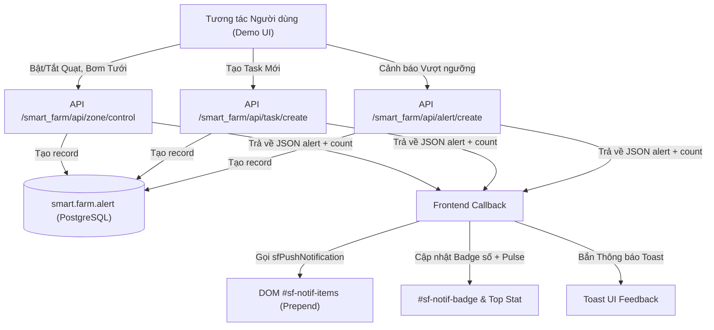

# Implementation Plan: Hệ thống Thông báo Kích hoạt theo Sự kiện Demo (Event-Driven Notification System)

**Feature**: `004-system-notification` | **Spec**: [`spec.md`](./spec.md)  
**Status**: Ready for Implementation (Chờ hiệu lệnh bắt đầu triển khai code)

---

## 1. Kiến trúc Kỹ thuật (Technical Architecture)



---

## 2. Chi tiết Thành phần Kỹ thuật

### 2.1 Backend Controllers & APIs (`smart_farm/controllers/main.py`)

1. **API Tạo Cảnh báo Trực tiếp (`POST /smart_farm/api/alert/create`)**:
   * Endpoint nhận dữ liệu JSON: `{name, content, alert_type, area}`.
   * Tạo bản ghi mới trong model `smart.farm.alert`.
   * Tính lại `unresolved_count = env['smart.farm.alert'].search_count([('is_resolved', '=', False)])`.
   * Trả về kết quả JSON chuẩn hóa:
     ```json
     {
       "success": true,
       "alert": {
         "id": 12,
         "name": "Cảnh báo nhiệt độ Khu A",
         "content": "Nhiệt độ đạt 38.5°C...",
         "alert_type": "danger",
         "area": "Khu A",
         "timestamp": "Vừa xong",
         "is_resolved": false
       },
       "unresolved_count": 5
     }
     ```

2. **Tích hợp Tự động Tạo Thông báo trong API Điều khiển Thiết bị (`/smart_farm/api/zone/control`)**:
   * Khi người dùng bật hoặc tắt thiết bị (quạt, tưới nhỏ giọt, phun sương, bơm):
     * Xác định nhãn và trạng thái thiết bị (`action_text`: "Bật" / "Tắt").
     * Tự động tạo bản ghi `smart.farm.alert`:
       * `name`: `f"{action_text} {dev_name}"` (Ví dụ: *"Bật Quạt thông gió đối lưu"*).
       * `content`: `f"Đã {action_text.lower()} {dev_name} tại Khu {zone}."`.
       * `alert_type`: `'info'` (nếu bật quạt/bơm) hoặc `'warning'` (nếu tắt thiết bị quan trọng).
       * `area`: `f"Khu {zone}"`.
     * Đính kèm đối tượng `alert` và `unresolved_count` vào JSON phản hồi để frontend push ngay.

3. **Tích hợp Tự động Tạo Thông báo trong API Tạo Công việc (`/smart_farm/api/task/create`)**:
   * Khi thêm task mới thành công:
     * Tự động tạo bản ghi `smart.farm.alert`:
       * `name`: `f"Công việc mới: {name}"`.
       * `content`: `f"Công việc '{name}' ({type_label}) đã được phân công."`.
       * `alert_type`: `'info'`.
       * `area`: `'Kế hoạch việc'`.
     * Đính kèm `alert` và `unresolved_count` vào JSON phản hồi.

4. **Tích hợp Tự động Tạo Thông báo khi Hoàn thành Công việc (`/smart_farm/api/task/toggle`)**:
   * Khi một task được tick `is_done = True`:
     * Tạo thông báo `"Đã hoàn thành công việc: {task.name}"` (loại `'success'` hoặc `'info'`).

---

### 2.2 Frontend Logic & Thời gian thực (`smart_farm/static/src/js/dashboard.js`)

1. **Hàm Trung tâm Đẩy Thông báo (`sfPushNotification(alertData, unresolvedCount)`)**:
   * Nhận `alertData` và `unresolvedCount` từ server response.
   * Xây dựng HTML item `.sf-notif-item`:
     * Icon SVG theo `alert_type` (đỏ danger, vàng warning, xanh info/success).
     * Tiêu đề `name`, thời gian `timestamp`, khu vực `area`.
     * Nút bấm *"Xử lý"* với sự kiện `sfResolveAlert(id)`.
   * **Chèn vào đầu danh sách**: `notifList.insertAdjacentHTML('afterbegin', html)`.
   * **Ẩn Empty State**: Ẩn `#sf-notif-empty-state` nếu đang hiển thị.
   * **Giới hạn số lượng**: Nếu tổng số phần tử con `.sf-notif-item` > 15, tự động xóa phần tử cuối cùng để giữ DOM tinh gọn.
   * **Đồng bộ toàn bộ UI**: Gọi `sfUpdateAlertsUI(unresolvedCount)` để tăng badge Navbar, hiển thị nhịp đập pulse, hiện nút *"Xử lý tất cả"* và cập nhật card thống kê.
   * **Hiển thị Toast**: Kích hoạt `window.sfShowToast(alertData.name, alertData.alert_type)`.

2. **Cập nhật Hàm Điều khiển Thiết bị (`sfToggleZoneDevice` / Event Handlers)**:
   * Sau khi nhận response thành công từ `/smart_farm/api/zone/control`:
     * Kiểm tra nếu `data.alert` tồn tại $\rightarrow$ gọi ngay `sfPushNotification(data.alert, data.unresolved_count)`.

3. **Cập nhật Hàm Tạo Task Mới (`sfSubmitNewTask`)**:
   * Sau khi tạo task thành công:
     * Kiểm tra nếu `data.alert` tồn tại $\rightarrow$ gọi `sfPushNotification(data.alert, data.unresolved_count)`.

4. **Hàm Mô phỏng Cảnh báo Demo (`sfSimulateSensorAlert(zone, sensorType)`)**:
   * Cung cấp tiện ích mô phỏng sự cố cảm biến (ví dụ: mô phỏng nhiệt độ tăng cao hoặc độ ẩm giảm thấp).
   * Gọi API `/smart_farm/api/alert/create` để phát sinh sự cố khẩn cấp phục vụ trình diễn demo.

---

### 2.3 Giao diện QWeb & CSS (`smart_farm/views/dashboard.xml`, `dashboard.css`)

* Đảm bảo cấu trúc `#sf-notif-items` hỗ trợ chèn động mượt mà với animation `@keyframes sfSlideInDown`.
* Bổ sung styling cho item mới chèn vào (`.sf-notif-new-highlight`) nhấp nháy nền nhẹ trong 1.5s để người dùng nhận diện thông báo vừa xuất hiện.

---

### 2.4 Toast UI Component với Thanh Tiến Trình Đếm Ngược (`dashboard.css`, `dashboard.js`)

* **Cấu trúc Toast Card**: `.sf-toast` bo góc 12px, nền trắng `#ffffff`, viền nhẹ `#e2e8f0`, đổ bóng mềm mại `0 10px 25px -5px rgba(0,0,0,0.1)`.
* **Thành phần**:
  * Icon trạng thái SVG (`.sf-toast-icon`) phân màu theo loại sự kiện.
  * Tiêu đề in đậm (`.sf-toast-title`), mô tả ngắn (`.sf-toast-desc`), nút đóng `×` (`.sf-toast-close`).
  * **Thanh đếm ngược đáy**: `.sf-toast-progress-track` và `.sf-toast-progress-bar` chạy animation CSS `@keyframes sfToastProgress` từ `scaleX(1)` về `scaleX(0)` đều đặn trong 4 giây.
* **Tự động đóng**: Hàm `window.sfShowToast` tự huỷ toast sau 4000ms với hiệu ứng trượt mờ `.sf-toast-hiding`.

---

### 2.5 Tinh Gọn Thẻ "Cảnh báo & Log" Trên Dashboard (Tối đa 3 mục) & Điều Hướng Chuông

* **Template QWeb (`dashboard.xml`)**:
  * Chỉ lặp hiển thị 3 phần tử mới nhất: `<t t-foreach="alerts[:3]" t-as="alert">`.
  * Nếu `len(alerts) > 3`:
    * Tiêu đề có nút liên kết `.sf-link-btn`: `Xem tất cả (len(alerts)) →`.
    * Chân danh sách có nút bấm `.sf-btn-view-all-notif`: `Xem thêm len(alerts) - 3 thông báo khác trong Quả Chuông 🔔`.
* **Thời gian thực (`dashboard.js`)**:
  * Khi hàm `sfPushNotification` nhận alert mới, chèn vào đầu `#sf-dash-alert-list`.
  * Giữ cố định tối đa 3 item: nếu `dashItems.length > 3`, tự động xóa `dashItems[dashItems.length - 1]`.
* **Điều hướng mở Quả Chuông (`sfOpenNotifications`)**:
  * Đóng các dropdown khác, tự động gắn class `.show` cho `#sf-notif-menu` và `.open` cho wrapper.
  * Cuộn mượt màn hình lên vị trí Quả chuông `#sf-notif-btn` để người dùng quan sát toàn bộ danh sách.

---

## 3. Kế hoạch Kiểm thử & Xác minh (Verification Plan)

1. **Test Case 1 — Tương tác Quạt / Máy bơm**:
   * Bấm bật quạt Khu A $\rightarrow$ Menu chuông nhảy số đếm (+1), nhấp nháy đỏ, mở dropdown thấy ngay thông báo *"Bật Quạt thông gió đối lưu tại Khu A"* ở đầu danh sách.
   * Bấm tắt quạt Khu A $\rightarrow$ Xuất hiện thông báo *"Tắt Quạt thông gió đối lưu tại Khu A"*.
2. **Test Case 2 — Tạo Công việc mới**:
   * Thêm một công việc mới trong tab Quản lý công việc $\rightarrow$ Dropdown nhận ngay thông báo *"Công việc mới: [Tên]"*.
3. **Test Case 3 — Xử lý 1-chạm & Xử lý tất cả**:
   * Bấm nút *"Xử lý"* tại thông báo vừa tạo $\rightarrow$ Chuyển thành *"Đã xong"*, số đếm chuông giảm 1.
   * Bấm *"Xử lý tất cả"* $\rightarrow$ Toàn bộ thông báo chuyển thành *"Đã xong"*, số đếm về 0, icon chuông ẩn badge đỏ.
4. **Test Case 4 — Tải lại trang (F5)**:
   * Sau khi có thông báo mới, F5 lại trang $\rightarrow$ Thông báo vẫn hiển thị đầy đủ (do đã được lưu vào PostgreSQL qua model `smart.farm.alert`).
5. **Test Case 5 — Toast với Thanh Tiến trình Đếm ngược**:
   * Khi kích hoạt thiết bị, Toast màu sắc nổi bật xuất hiện ở góc trên phải với thanh tiến trình đáy co dần trong 4s và tự biến mất.
6. **Test Case 6 — Thẻ Dashboard giới hạn 3 mục & Điều hướng Quả Chuông**:
   * Thẻ "Cảnh báo & Log" chỉ hiện đúng 3 mục. Bấm "Xem tất cả" hoặc "Xem thêm" sẽ mở ngay dropdown quả chuông với danh sách đầy đủ.

