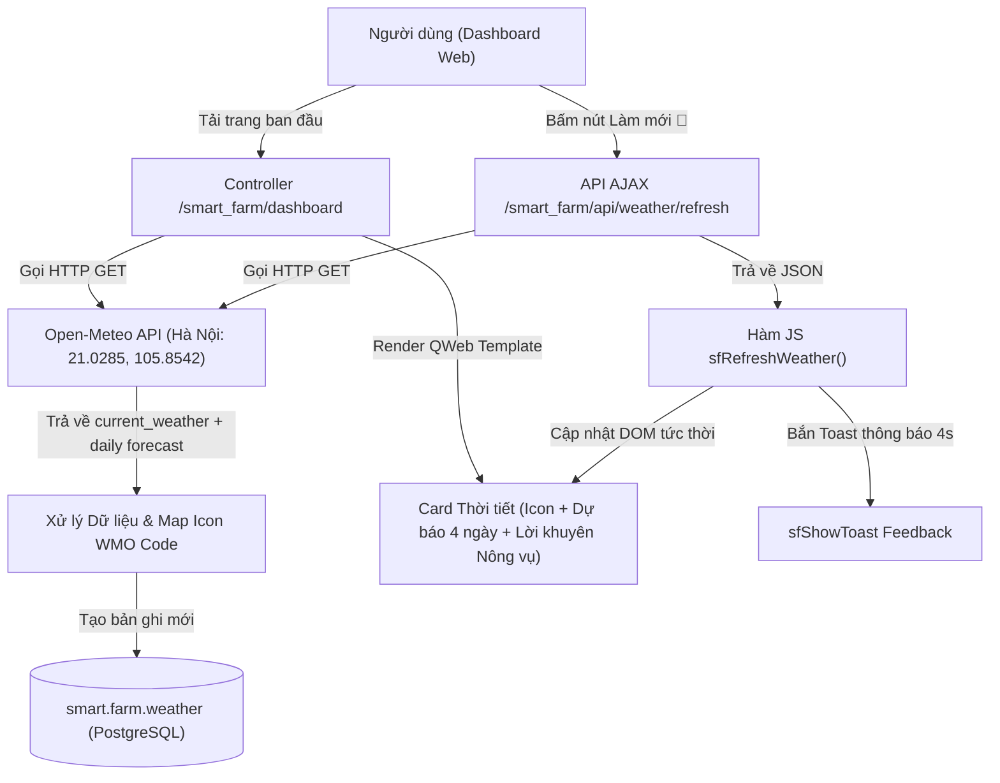

# Implementation Plan: Hệ thống Giám sát & Dự báo Thời tiết Nông nghiệp Thông minh tại Hà Nội

**Feature**: `005-weather-monitoring` | **Spec**: [`spec.md`](./spec.md)  
**Status**: Ready for Task Breakdown  

---

## 1. Kiến trúc Kỹ thuật (Technical Architecture)



---

## 2. Chi tiết Thành phần Kỹ thuật

### 2.1 Cập nhật Model CSDL Odoo (`smart_farm/models/weather.py`)
1. **Thiết lập chuẩn vị trí TP. Hà Nội**:
   - `location`: Giá trị mặc định `'TP. Hà Nội'`.
   - `latitude`: `21.0285` (tọa độ trung tâm Hà Nội).
   - `longitude`: `105.8542`.
2. **Bổ sung trường lưu trữ mã thời tiết & dự báo**:
   - `weather_code`: `fields.Integer(string='Mã thời tiết WMO')`
   - Cập nhật hàm `fetch_and_save()` gọi đúng tọa độ Hà Nội và lưu trữ mã thời tiết.

---

### 2.2 Controller & API Backend (`smart_farm/controllers/main.py`)
1. **Nâng cấp Controller `dashboard`**:
   - Thay đổi tọa độ truy vấn Open-Meteo: `latitude=21.0285&longitude=105.8542`.
   - Mở rộng tham số URL lấy dự báo hàng ngày: `daily=weathercode,temperature_2m_max,temperature_2m_min&timezone=Asia/Bangkok`.
   - Xây dựng từ điển ánh xạ chuẩn **WMO Weather Code** sang Icon và mô tả:
     - `0`: Trời quang đãng ☀️
     - `1, 2, 3`: Ít mây / Nhiều mây ⛅
     - `45, 48`: Sương mù 🌫️
     - `51 - 67, 80 - 82`: Mưa phùn / Mưa rào 🌧️
     - `95, 96, 99`: Dông bão ⛈️
   - Trích xuất dự báo 4 ngày thực tế:
     - *Hôm nay*: Nhiệt độ hiện tại + icon.
     - *Ngày mai*, *Ngày kia*, *Sau đó*: Nhiệt độ max/min dự báo thực tế từ Open-Meteo + icon.
   - Phân tích và sinh lời khuyên nông vụ tự động (`agri_advice`):
     - Ví dụ: Độ ẩm cao >85% $\rightarrow$ *"Độ ẩm cao: Chú ý lưu thông gió nhà màng, hạn chế nấm lá."*
     - Nhiệt độ >34°C $\rightarrow$ *"Nắng gắt: Cần che rèm nhà màng và chạy quạt đối lưu."*
     - Thời tiết mát mẻ 22-29°C $\rightarrow$ *"Thời tiết lý tưởng cho cây trồng phát triển."*
   - Cơ chế Fallback sang bản ghi database gần nhất nếu gọi API thất bại.

2. **API Làm Mới Dữ Liệu Thời Tiết Mới (`POST /smart_farm/api/weather/refresh`)**:
   - Endpoint nhận AJAX từ frontend.
   - Thực hiện fetch dữ liệu thời tiết mới nhất tại Hà Nội.
   - Lưu bản ghi vào `smart.farm.weather`.
   - Trả về JSON chuẩn hóa chứa dữ liệu hiện tại, mảng dự báo 4 ngày và lời khuyên nông nghiệp.

---

### 2.3 Giao diện QWeb Template (`smart_farm/views/dashboard.xml`)
1. **Tiêu đề Thẻ**:
   - Thêm nút làm mới 🔄 dạng icon xoay:
     ```xml
     <button type="button" class="sf-weather-refresh-btn" id="sf-btn-refresh-weather" onclick="sfRefreshWeather(this)" title="Cập nhật thời tiết Hà Nội tức thời">
         <svg width="13" height="13" viewBox="0 0 24 24" fill="none" stroke="currentColor" stroke-width="2.3">
             <path d="M21.5 2v6h-6M21.34 15.57a10 10 0 1 1-.57-8.38l5.67-5.67"/>
         </svg>
     </button>
     ```
2. **Khối Nhiệt độ Hiện tại & Icon**:
   - Hiển thị icon thời tiết sinh động (☀️, ⛅, 🌧️,...) cạnh số nhiệt độ lớn.
   - Hiển thị tên địa danh **TP. Hà Nội**.
3. **Khối Dự báo 4 Ngày Động**:
   - Thay thế toàn bộ các thẻ `<div class="sf-fc-day">` fix cứng bằng vòng lặp `<t t-foreach="weather['forecast']" t-as="fc">`.
   - Mỗi ngày hiển thị: Tên ngày (Hôm nay, Ngày mai, Ngày kia, Sau đó), Icon thời tiết, và nhiệt độ dự báo thực tế.
4. **Khối Khuyến nghị Nông vụ (Agri-Advice)**:
   - Hiển thị thanh gợi ý canh tác nhỏ gọn dưới đáy card:
     `<div class="sf-weather-advice" id="sf-weather-advice"><t t-esc="weather['agri_advice']"/></div>`

---

### 2.4 CSS Styling & Hiệu ứng (`smart_farm/static/src/css/dashboard.css`)
1. Styling cho nút `.sf-weather-refresh-btn` với hiệu ứng hover và animation `@keyframes sfSpin` khi đang tải.
2. Styling cho `.sf-weather-icon-lg` và icon dự báo `.sf-fc-icon`.
3. Styling cho thanh gợi ý nông vụ `.sf-weather-advice` (nền xanh lá nhạt / cam nhạt, chữ 11.5px tinh tế, icon lá cây 🌿).

---

### 2.5 Frontend Logic JavaScript (`smart_farm/static/src/js/dashboard.js`)
1. **Hàm `sfRefreshWeather(btn)`**:
   - Thêm class xoay `spinning` vào icon nút.
   - Gửi request `fetch('/smart_farm/api/weather/refresh', { method: 'POST' })`.
   - Khi có kết quả:
     - Cập nhật số nhiệt độ, gió, độ ẩm, địa danh Hà Nội.
     - Cập nhật icon thời tiết và dải dự báo 4 ngày.
     - Cập nhật lời khuyên nông nghiệp.
     - Bắn Toast thông báo qua `window.sfShowToast('Đã cập nhật thời tiết Hà Nội mới nhất!', 'success')`.
   - Gỡ bỏ class `spinning` sau khi hoàn tất.

---

## 3. Kế hoạch Kiểm thử & Nghiệm thu (Verification Plan)

1. **Test Case 1 — Tải trang & Hiển thị Đúng Thời Tiết Hà Nội**:
   - F5 trang Dashboard $\rightarrow$ Thẻ hiển thị địa danh "TP. Hà Nội", nhiệt độ thực tế lấy từ tọa độ Hà Nội (`21.0285, 105.8542`), badge nguồn "Trực tiếp".
2. **Test Case 2 — Dự báo 4 Ngày Động**:
   - Quan sát 4 ô dự báo $\rightarrow$ Hiển thị các giá trị nhiệt độ và icon thực tế từ Open-Meteo, không còn fix cứng 29°, 28°, 30°.
3. **Test Case 3 — Bấm Nút Làm Mới 🔄**:
   - Click nút làm mới $\rightarrow$ Nút xoay 1 vòng, Toast thông báo xuất hiện, số liệu cập nhật tức thời không giật màn hình.
4. **Test Case 4 — Khuyến nghị Canh tác Nông vụ**:
   - Kiểm tra dòng gợi ý dưới đáy thẻ hiển thị phù hợp với điều kiện thời tiết thực tế.
5. **Test Case 5 — Ngoại tuyến & Database**:
   - Kiểm tra bảng `smart.farm.weather` trong CSDL PostgreSQL có lưu bản ghi tọa độ Hà Nội và dữ liệu tương ứng.
