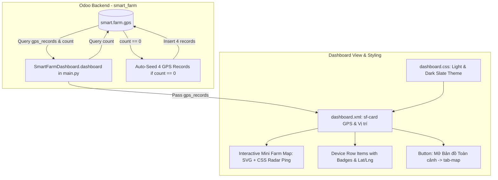

# Kế Hoạch Kỹ Thuật: Nâng Cấp Widget GPS & Vị Trí Trực Quan (Interactive GPS Mini-Map & Seed Data)

**Feature Branch**: `007-gps-tracking-widget`  
**Created**: 2026-10-10  
**Status**: Lập Kế hoạch Kiến trúc (Step 2 of Lifecycle)  
**Input**: Đặc tả từ [`spec.md`](./spec.md)

---

## 1. Kiến Trúc Kỹ Thuật Tổng Thể (Architecture Overview)



---

## 2. Chi Tiết Triển Khai Kỹ Thuật

### 2.1. Backend Logic (`smart_farm/controllers/main.py`)
- **Tự động khởi tạo dữ liệu mẫu khi rỗng**:
  Trong phương thức `dashboard()`, kiểm tra:
  ```python
  gps_count = env['smart.farm.gps'].search_count([])
  if gps_count == 0:
      # Tự động nạp 4 thiết bị mẫu đại diện
      seed_data = [
          {'name': 'Máy kéo Kubota M7040', 'device_type': 'tractor', 'latitude': 21.028511, 'longitude': 105.854167, 'notes': 'Đang cày xới Khu B'},
          {'name': 'Xe tuần tra ATV #02', 'device_type': 'phone', 'latitude': 21.029800, 'longitude': 105.855600, 'notes': 'Tuần tra vành đai Khu C'},
          {'name': 'Drone phun thuốc DJI T40', 'device_type': 'other', 'latitude': 21.027400, 'longitude': 105.853200, 'notes': 'Phun thuốc sinh học Khu A'},
          {'name': 'Trạm thời tiết tự động IoT', 'device_type': 'sensor', 'latitude': 21.028900, 'longitude': 105.854900, 'notes': 'Giám sát vi khí hậu'}
      ]
      for s in seed_data:
          env['smart.farm.gps'].sudo().create(s)
  ```
- Lấy `gps_records = env['smart.farm.gps'].search([], limit=5, order='timestamp desc')` để truyền sang template.

### 2.2. Giao Diện Bản Đồ Mini (`smart_farm/views/dashboard.xml`)
- Thay thế khung chữ nhật tĩnh `sf-gps-map` cũ bằng cấu trúc **Mini Farm Map trực quan**:
  - Khung bản đồ thu nhỏ `.sf-mini-map`: Có nền quy hoạch trang trại với các phân khu mờ (Khu A - Nhà màng, Khu B - Cánh đồng mở, Khu C - Vườn cây, Hồ nước).
  - Các điểm ghim thiết bị `.sf-mini-pin`:
    - Điểm ghim máy kéo (Icon máy kéo nhỏ, viền xanh lá, hiệu ứng radar `pulse-ping`).
    - Điểm ghim xe tuần tra (Icon xe, viền xanh dương, hiệu ứng radar).
    - Điểm ghim drone (Icon drone, viền vàng hổ phách).
    - Điểm ghim trạm IoT (Icon trạm phát sóng, viền tím).
    - Tooltip hover trực quan: Tên thiết bị, Tọa độ Lat/Long, Trạng thái hoạt động.
  - Danh sách thiết bị dạng thẻ gọn gàng: Icon, Tên thiết bị in đậm, Badge phân loại thiết bị, Tọa độ kinh/vĩ độ, Giờ cập nhật.
  - Thanh tác vụ chân thẻ: Nút bấm **"Xem bản đồ toàn cảnh →"** gọi `sfOpenTab(event, 'tab-map')` để chuyển tab mượt mà.

### 2.3. Thiết Kế Giao Diện & Dark Mode (`smart_farm/static/src/css/dashboard.css`)
- **Hiệu ứng Radar Ping**: `@keyframes sfRadarPulse` tạo vòng tròn sóng lan tỏa liên tục quanh các phương tiện đang hoạt động.
- **Phong cách Bản đồ Mini**: Mặt bằng sắc nét với đường ranh giới trang trại, gradient nhẹ nhàng tạo cảm giác không gian thực địa.
- **Tương thích 100% Dark Slate Theme**:
  - Nền bản đồ mini ở Dark Mode: `#0f172a` với border `#334155`.
  - Các phân khu trong bản đồ mini: Nền trong suốt với viền `#334155` và chữ mờ `#64748b`.
  - Tên thiết bị và tọa độ: Màu `#e2e8f0` và `#94a3b8`, độ tương phản cao, chống lóa mắt.

---

## 3. Kế Hoạch Kiểm Thử & Tiêu Chí Nghiệm Thu

1. **Kiểm thử Tự động nạp dữ liệu**:
   - Khi vào Dashboard lần đầu, bảng `smart.farm.gps` tự động được nạp 4 bản ghi.
   - Thẻ thống kê đỉnh "BẢN GHI GPS" hiển thị số `4`.
2. **Kiểm thử Bản đồ Mini**:
   - Các điểm ghim hiển thị đầy đủ tại vị trí tương ứng trên bản đồ thu nhỏ.
   - Hiệu ứng radar ping hoạt động mượt mà, không giật lag.
   - Hover chuột hiển thị tooltip đúng thông tin thiết bị.
3. **Kiểm thử Chuyển Tab**:
   - Bấm nút "Xem bản đồ toàn cảnh →" chuyển ngay sang tab Bản đồ lớn (`tab-map`).
4. **Kiểm thử 2 chế độ Sáng / Tối**:
   - Nhấn nút toggle mặt trăng/mặt trời, bản đồ mini chuyển đổi màu sắc mượt mà, 0 lỗi tương phản.
