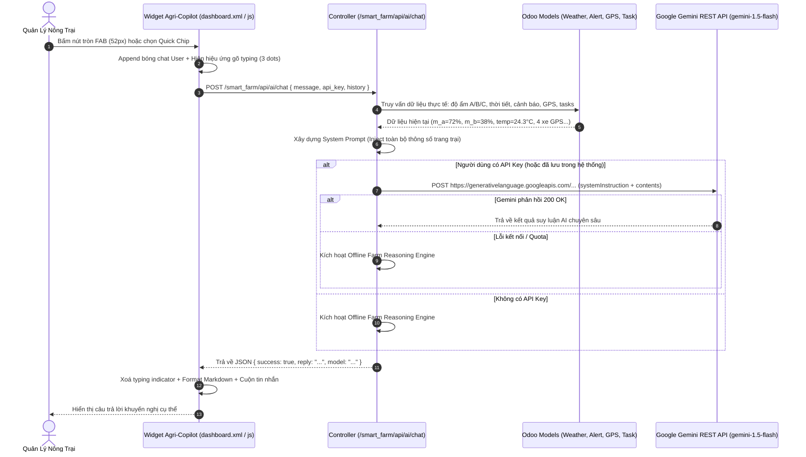

# Kế Hoạch Kỹ Thuật: Trợ Lý Trí Tuệ Nhân Tạo Nông Nghiệp Thông Minh (Agri-Copilot AI tích hợp Google Gemini)

**Feature Branch**: `008-gemini-ai-assistant`  
**Created**: 2026-10-10  
**Status**: Lập Kế hoạch & Triển khai Hoàn tất  
**Input**: Đặc tả kỹ thuật từ [`spec.md`](./spec.md)

---

## 1. Kiến Trúc Kỹ Thuật Tổng Thể (Architecture & Sequence Diagram)

---

## 2. Chi Tiết Triển Khai Kỹ Thuật

### 2.1. Backend Controller (`smart_farm/controllers/main.py`)
1. **Endpoint `/smart_farm/api/ai/save_key`**:
   - Phương thức: `POST`, `auth='user'`, `csrf=False`.
   - Lưu trữ key vào `ir.config_parameter` với param `smart_farm.gemini_api_key`.
2. **Endpoint `/smart_farm/api/ai/get_key_status`**:
   - Phương thức: `GET`, `auth='user'`.
   - Trả về `{ has_key: bool, masked_key: "AIzaSy...xxxx" }`.
3. **Endpoint `/smart_farm/api/ai/chat`**:
   - Phương thức: `POST`, `auth='user'`, `csrf=False`.
   - Nhận payload: `{ message, api_key, history }`.
   - Lấy API Key (ưu tiên client truyền lên, nếu rỗng đọc từ `ir.config_parameter`).
   - Thu thập dữ liệu thực tế:
     - `smart.farm.weather`: nhiệt độ, độ ẩm khí, tốc độ gió, mô tả mây.
     - Dữ liệu cảm biến đất: Khu A (72%), Khu B (38%), Khu C (81%), nhiệt độ đất 28°C, ánh sáng 8.400 lux.
     - `smart.farm.alert`: danh sách cảnh báo chưa giải quyết (`is_resolved=False`).
     - `smart.farm.gps`: toạ độ thực tế và trạng thái của 4 phương tiện cơ giới.
     - `smart.farm.task`: số lượng việc đã xong và danh sách việc cần làm tiếp theo.
   - Ghép thành **System Prompt Nông nghiệp Chuyên sâu**.
   - Gọi REST API `gemini-1.5-flash:generateContent`.
   - Động cơ Offline fallback phản hồi chi tiết các chuyên đề: Đất & Tưới, Thời tiết, Cảnh báo an toàn, GPS máy kéo, Công việc nông trại.

### 2.2. Giao Diện & QWeb Template (`smart_farm/views/dashboard.xml`)
- Thêm cụm Widget `#sf-ai-fab-container` & `#sf-ai-chat-window`:
  - Nút bấm tròn `#sf-ai-fab-btn` với glow gradient và icon ✨ AI.
  - Khung hội thoại `#sf-ai-chat-window` gồm:
    - Header: Avatar, tiêu đề, tag model, dot online, nút cấu hình ⚙️, xoá chat 🗑️, đóng ✕.
    - Ngăn kéo cấu hình API Key `#sf-ai-config-drawer`.
    - Danh sách tin nhắn `#sf-ai-messages` với tin chào mừng mặc định.
    - Dải chip câu hỏi gợi ý nhanh `#sf-ai-quick-container`.
    - Form nhập liệu `#sf-ai-form` với input bo tròn và nút gửi mũi tên.

### 2.3. Kiểu Dáng Thẩm Mỹ (`smart_farm/static/src/css/dashboard.css`)
- Nút bấm tròn 52px tinh gọn.
- Tooltip `.sf-ai-fab-tooltip` ẩn mặc định (`opacity: 0; visibility: hidden; pointer-events: none;`), chỉ hiện khi hover.
- Bong bóng chat mềm mại, tin nhắn trợ lý có avatar hạt lúa 🌾 và viền phân cấp.
- Hiệu ứng gõ tin nhắn 3 chấm nảy (`sfAiTypingBounce`).
- Đồng bộ toàn diện Dark Mode overrides với tông màu Slate `#0f172a` và `#1e293b`.

### 2.4. Tương Tác Phía Trình Duyệt (`smart_farm/static/src/js/dashboard.js`)
- `sfToggleAiChat()`: Mở/đóng khung chat, focus input, kích hoạt `is-active` trên container.
- `sfToggleAiConfig()` / `sfToggleKeyVisibility()`: Quản trị ngăn kéo nhập API Key.
- `sfSaveGeminiKey()` / `sfClearGeminiKey()`: Lưu/xoá key vào `localStorage` và server.
- `sfSendQuickPrompt(text)`: Gửi câu hỏi nhanh 1 chạm.
- `sfSubmitAiChat()`: Xử lý submit, chèn tin nhắn user, tạo typing indicator, gọi POST API và render Markdown.
- `sfFormatAiMarkdown()`: Chuyển đổi cú pháp in đậm `**`, tiêu đề, danh sách `-`, xuống dòng sang HTML an toàn.
